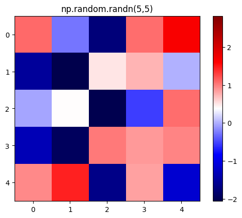

mjwt
================

<!-- WARNING: THIS FILE WAS AUTOGENERATED! DO NOT EDIT! -->

Hi there you have reached my illusterous python package containing my
own tools

## Install

``` sh
pip install mjwt
```

## How to use

Im now gonna do a short code example:

``` python
```

    2

``` python
import numpy as np
from mjwt.utils import implot
implot(np.random.randn(5,5), show=True)
```

    [6.72, 4.8] 1 1



Bang, an implot above. There are other function inside of mjwt.utils and
there are notebooks with snippets in ./nbs/ which are mirrored on
[mennowitteveen.github.io/mjwt/](mennowitteveen.github.io/mjwt/).

Have a great day!
